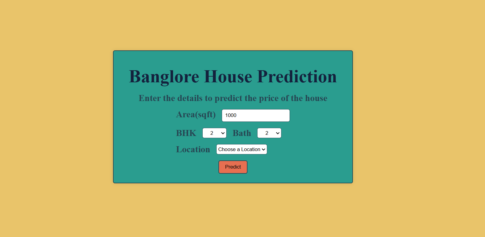

# House Price Prediction Website

This is a web-based application designed to predict house prices in Bangalore using machine learning models. The platform enables users to input details about a property and get an estimated price based on trained models.

## Features
- **User-friendly Interface**: An intuitive and responsive design for seamless user experience.
- **Prediction Model**: Uses machine learning to provide accurate house price estimates.
- **Location-Specific Data**: Tailored to Bangalore's real estate market.
- **Interactive Elements**: Allows users to input property details like location, size, and amenities.
- **Real-time Results**: Predicts prices instantly after form submission.

## Video Demo

<video width="320" height="240" controls>
  <source src="./Vinayak-Khavare-House-Prediction-Model-Banglore.mp4" type="video/mp4">
</video>

## How It Works
1. **Input Property Details**: Users fill out a form with relevant property details such as location, number of bedrooms, bathrooms, and square footage.
2. **Prediction Engine**: The backend processes the inputs using a pre-trained machine learning model.
3. **Price Estimate**: The system displays the estimated price of the property based on the inputs provided.

## Technologies Used
- **Frontend**: HTML, CSS, JavaScript
- **Backend**: Python Flask
- **Machine Learning**: scikit-learn, pandas, NumPy

## Dataset
The prediction model is trained on real estate data specific to Bangalore. Features include:
- Property location
- Square foot Area
- Number of bedrooms and bathrooms

## Contact
For questions or suggestions, feel free to reach out at [vinayakkhavare82@gmail.com].

